#  Hi, I'm Nachiketa Singamsetty

<div align="center">
  
</div>

<p align="center">
  
  
</p>

---

## 🚀 About Me

```python
class NachiketaSingamsetty:
    def __init__(self):
        self.role = "Computer Science Undergrad"
        self.focus = ["AI/ML", "Deep Learning", "Software Engineering"]
        self.philosophy = "Build things that are useful, thoughtful, and surprising"
        self.current_status = "Always learning, always building"
    
    def get_skills(self):
        return {
            "languages": ["Python 🐍", "C++ ⚡", "Java ☕"],
            "ai_ml": ["PyTorch", "TensorFlow", "Keras", "NLP", "Computer Vision"],
            "databases": ["MySQL", "Data Pipelines"],
            "mindset": ["Clean Code", "UX-First", "Documentation Obsessed"]
        }
    
    def current_vibe(self):
        return "Turning coffee into code and ideas into reality ☕→💻"
```

<div align="center">
  
  
</div>

---

## 🛠️ Tech Arsenal

<div align="center">

### Languages & Frameworks


### Tools & Platforms  


</div>

<details>
<summary>📊 <b>Detailed GitHub Stats</b></summary>
<br>

<div align="center">
  
</div>

<div align="center">
  
</div>

</details>

---

## 🎯 Featured Projects

<div align="center">

| 🕹️ **Game Code Iterator** | 🧠 **Mental Health Chatbot** |
|:---:|:---:|
|  |  |
| *Developer-first AI tool for game code iteration* | *NLP-based mental health support system* |
| `AI` `Developer Tools` `Code Review` | `NLP` `Healthcare` `Support System` |

| 🦯 **Ishare Smart Cane** | 🔐 **Pattern Lock Cryptography** |
|:---:|:---:|
|  |  |
| *Real-time object detection with YOLO + RPi* | *Matrix-based encryption via visual patterns* |
| `Computer Vision` `IoT` `Accessibility` | `Cryptography` `UI/UX` `Security` |

</div>

<div align="center">
  <a href="#projects">
    
  </a>
</div>

---

## 📈 Contribution Graph

<div align="center">
  
</div>

---

## 🎯 What Drives Me

```mermaid
mindmap
  root((Nachiketa))
    🚀 Innovation
      Useful Solutions
      Thoughtful Design
      Surprising Elements
    💻 Technical Excellence
      Clean Code
      UX Focus
      Documentation
    🤝 Collaboration
      Team Impact
      Constructive Feedback
      Bad Puns in Comments
    🌱 Growth
      Always Learning
      Battle-tested Code
      Real-world Impact
```

<div align="center">



</div>

---

## 🤝 Let's Connect & Collaborate

<div align="center">

**Looking to work with teams who:**
- 🎯 Care about **impact** *and* **implementation**
- 🧹 Appreciate **clean code** and **constructive pushback**  
- 😄 Are okay with the **occasional bad pun** in comments

<br>

[](mailto:nachiketa3003@gmail.com)
[](https://linkedin.com/in/nachiketa-singamsetty)

</div>

---

<div align="center">

### 💭 *"Code is poetry written in logic"* 


**⭐ If you like what you see, don't forget to star some repos!**

</div>

---

<div align="center">
  
</div>
