# <div align="center">👋 Hi, I'm Nachiketa Singamsetty</div>

<div align="center">
  
</div>

<div align="center">
  
  
</div>

---

## 🚀 About Me


```python
class NachiketaSingamsetty:
    def __init__(self):
        self.name = "Nachiketa Singamsetty"
        self.role = "CS Undergrad & AI/ML Explorer"
        self.location = "India"
        self.learning_philosophy = "Building, breaking, and learning"
        
    def current_focus(self):
        return [
            "Deep Learning & NLP",
            "GenAI & LLMs", 
            "Building meaningful applications",
            "Learning the hard way (but loving it)"
        ]
    
    def fun_fact(self):
        return "I debug more than I code, but that's where the magic happens! ✨"
```

> *"I'm driven by building things that are useful, thoughtful, and a little surprising."*

---

## 🛠️ Tech Arsenal

<div align="center">

### Languages & Frameworks


### AI/ML & Data Science


### Tools & Technologies


</div>

---

## 🎯 Featured Projects

<div align="center">
  <table>
    <tr>
      <td width="50%">
        <h3 align="center">🕹️ Game Code Iterator</h3>
        <div align="center">  
          <a href="#" target="_blank">
            
          </a>
          <br>
          <br>
          <p>
            
            
            
          </p>
          <p><strong>AI-Powered Game Development Tool</strong><br>Local LLM integration for real-time code refinement with 90% accuracy in suggestions. Complete privacy with offline inference.</p>
        </div>
      </td>
      <td width="50%">
        <h3 align="center">🧠 Mental Health Chatbot</h3>
        <div align="center">  
          <a href="#" target="_blank">
            
          </a>
          <br>
          <br>
          <p>
            
            
            
          </p>
          <p><strong>Context-Aware Mental Health Support</strong><br>97% response accuracy with rule-based, retrieval-based, and generative models. Real impact for mental wellness.</p>
        </div>
      </td>
    </tr>
    <tr>
      <td width="50%">
        <h3 align="center">🦯 Ishare Smart Cane</h3>
        <div align="center">  
          <a href="#" target="_blank">
            
          </a>
          <br>
          <br>
          <p>
            
            
            
          </p>
          <p><strong>AI-Powered Assistive Technology</strong><br>Real-time object detection with voice commands. 15cm precision proximity detection for enhanced spatial awareness.</p>
        </div>
      </td>
      <td width="50%">
        <h3 align="center">🔐 Pattern Lock Cryptography</h3>
        <div align="center">  
          <a href="#" target="_blank">
            
          </a>
          <br>
          <br>
          <p>
            
            
            
          </p>
          <p><strong>Visual Cryptography Innovation</strong><br>10 distinct encryption patterns using matrix operations. Published in Bennett University library.</p>
        </div>
      </td>
    </tr>
  </table>
</div>

---

## 📊 GitHub Analytics

<div align="center">
  
  
</div>

<div align="center">
  
</div>

<div align="center">
  
</div>

---

## 🎨 Current Learning Journey

```mermaid
graph TD
    A[🎓 CS Foundations] --> B[🤖 AI/ML Exploration]
    B --> C[🧠 Deep Learning & NLP]
    C --> D[🚀 GenAI & LLMs]
    D --> E[🔮 Future: AGI Research?]
    
    B --> F[💡 Real-World Projects]
    F --> G[🌟 Meaningful Impact]
    
    style A fill:#ff6b6b
    style B fill:#4ecdc4
    style C fill:#45b7d1
    style D fill:#96ceb4
    style E fill:#feca57
    style F fill:#ff9ff3
    style G fill:#54a0ff
```

<div align="center">



</div>

---

## 🤝 Let's Connect & Collaborate

<div align="center">

### Looking to work with teams who:
- 🎯 Care about **impact** *and* **implementation**
- 🧹 Appreciate **clean code** and **constructive feedback**
- 😄 Are okay with the occasional **bad pun** in comments

<br>

[](https://linkedin.com/in/nachiketa-singamsetty)
[](mailto:nachiketa3003@gmail.com)
[](https://github.com/Nachiketa-Singamsetty)

</div>

---

<div align="center">
  
</div>

<div align="center">
  <i>If you're here from my résumé, thanks for checking out my work.<br>
  If not — nice to meet you anyway! 👋</i>
</div>

---

<div align="center">
  
  
</div>
